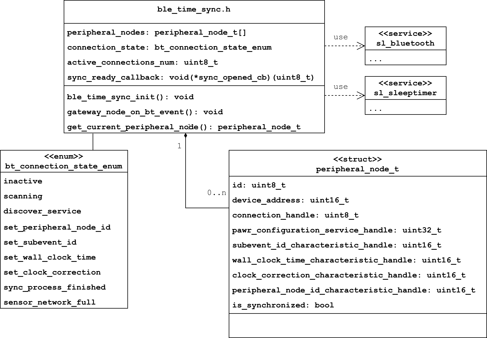

# BLE Time Sync API for Silabs EFR32 devices

The BLE Time Sync is a project that you can use to synchronize BLE WSNs (*Bluetooth Low Energy® Wireless Sensor Network*).
The synchronization method is based on the PAwR (*Periodic Advertising with Responses*) feature of BLE
as shown in the following figure.

## Getting Started

This project made by Simplicity Studio, which is the IDE provided by Silicon laboratories.
More info here: ([QSG169: Bluetooth SDK v3.x Quick Start Guide](https://www.silabs.com/documents/public/quick-start-guides/qsg169-bluetooth-sdk-v3x-quick-start-guide.pdf).

Information about the PAwR functionality in more detailes here:
[AN1419: Bluetooth® LE Electronic Shelf Label](https://www.silabs.com/documents/public/application-notes/an1419-ble-electronic-shelf-label.pdf)

To read about Bluetooth technology basics, see [UG103.14: Bluetooth LE Fundamentals](https://www.silabs.com/documents/public/user-guides/ug103-14-fundamentals-ble.pdf).
 
Developer guide: [UG434: Silicon Labs Bluetooth ® C Application Developer's Guide for SDK v3.x](https://www.silabs.com/documents/public/user-guides/ug434-bluetooth-c-soc-dev-guide-sdk-v3x.pdf).

## Example

You can find example application project files (.slcp) and sources in the example folder:
* **ble_wsn_ap** - project for central device (access point)
* **ble_wsn_pn** - project for peripheral devices (peripheral node)

This example application works with only Thunderboard Dev Kit xg24, see [UG524: xG24 Dev Kit User's Guide](https://www.silabs.com/documents/public/user-guides/ug524-brd2601b-user-guide.pdf).

You can import slcp files directly in Simplicity Studio.

## Clock Sync Process

## Clock Sync Results

## Class Diagrams

### For Gateway node

### For Peripheral node

